# Claude Code in Action

A comprehensive course on mastering Claude Code, Anthropic's official CLI tool for software engineering tasks.

## Table of Contents

1. [Understanding Coding Assistants](#1-understanding-coding-assistants)
2. [Core Features and Tools](#2-core-features-and-tools)
3. [Advanced Capabilities](#3-advanced-capabilities)
4. [Configuration and Customization](#4-configuration-and-customization)
5. [Integrations and Extensions](#5-integrations-and-extensions)
6. [Real-World Project: UIGen](#6-real-world-project-uigen)
7. [Key Takeaways](#7-key-takeaways)

---

## 1. Understanding Coding Assistants

### What Makes a Coding Assistant Different?

A coding assistant is more than just a tool that writes code - it's a sophisticated system that uses language models to tackle complex programming tasks. Understanding how these assistants work behind the scenes helps you appreciate what makes a truly powerful coding companion.

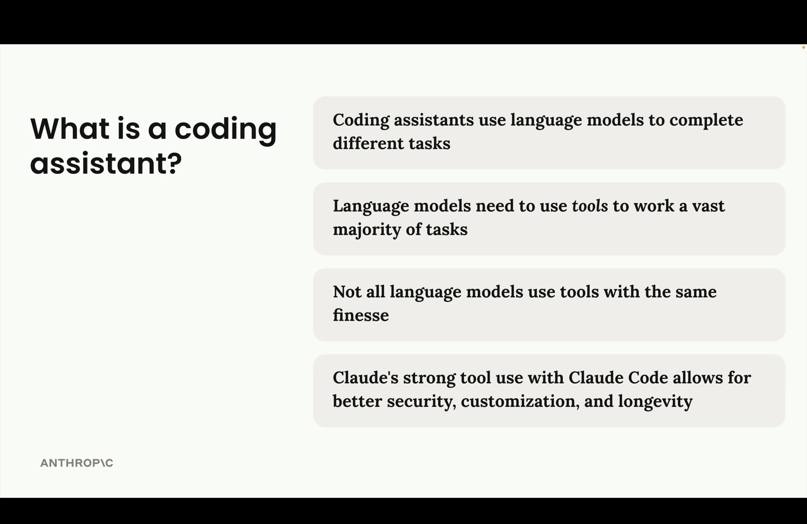

### The Power of Tool Integration

The difference between chatting with an ordinary LLM and using a coding assistant lies in the tools available. A coding assistant can:

- Read and analyze your codebase
- Execute shell commands
- Edit files intelligently
- Navigate complex project structures
- Understand context across multiple files

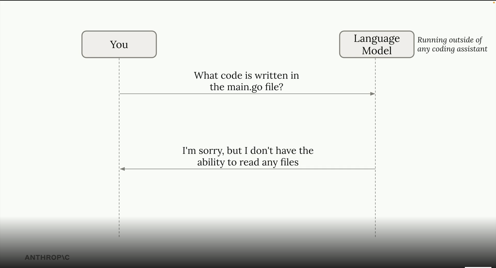

### Strong Tool Use Benefits

Claude Code's sophisticated tool integration provides three key advantages:

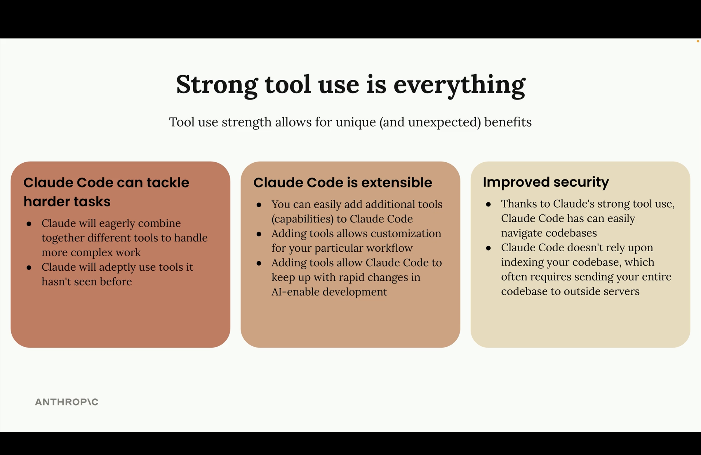

1. **Tackles Harder Tasks**: Claude eagerly combines tools to handle complex, multi-step work
2. **Extensibility**: Easy addition of custom tools and capabilities 
3. **Improved Security**: Local execution with intelligent codebase navigation

---

## 2. Core Features and Tools

### Available Tools Overview

Claude Code comes with a comprehensive set of built-in tools designed for software engineering tasks:

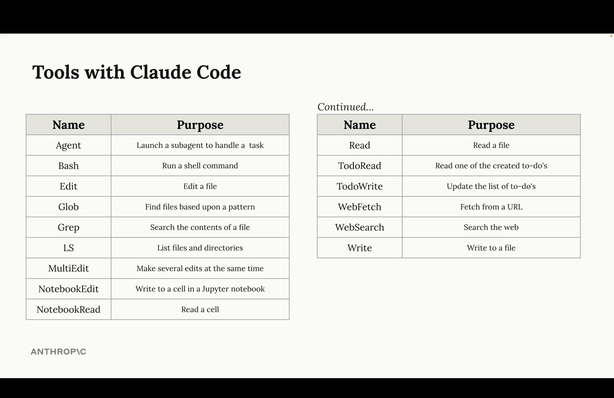

**Essential Tools:**
- **Read**: Access file contents across multiple formats
- **Write/Edit**: Intelligent file modification
- **Bash**: Execute shell commands safely
- **Glob**: Pattern-based file discovery
- **Grep**: Advanced text search with regex support
- **TodoWrite**: Task management and progress tracking

**Advanced Tools:**
- **MultiEdit**: Batch file modifications
- **NotebookEdit**: Jupyter notebook integration
- **WebFetch/WebSearch**: Internet access for research
- **Agent**: Specialized sub-agents for complex tasks

### Planning and Thinking Modes

#### Planning Mode

For complex tasks requiring extensive codebase research, Planning Mode provides thorough exploration before implementation.

**Activation**: Press `Shift + Tab` twice (or once if auto-accepting edits)

**Planning Mode Features:**
- Comprehensive file reading and analysis
- Detailed implementation planning
- Step-by-step execution roadmap
- User approval before proceeding

#### Thinking Modes

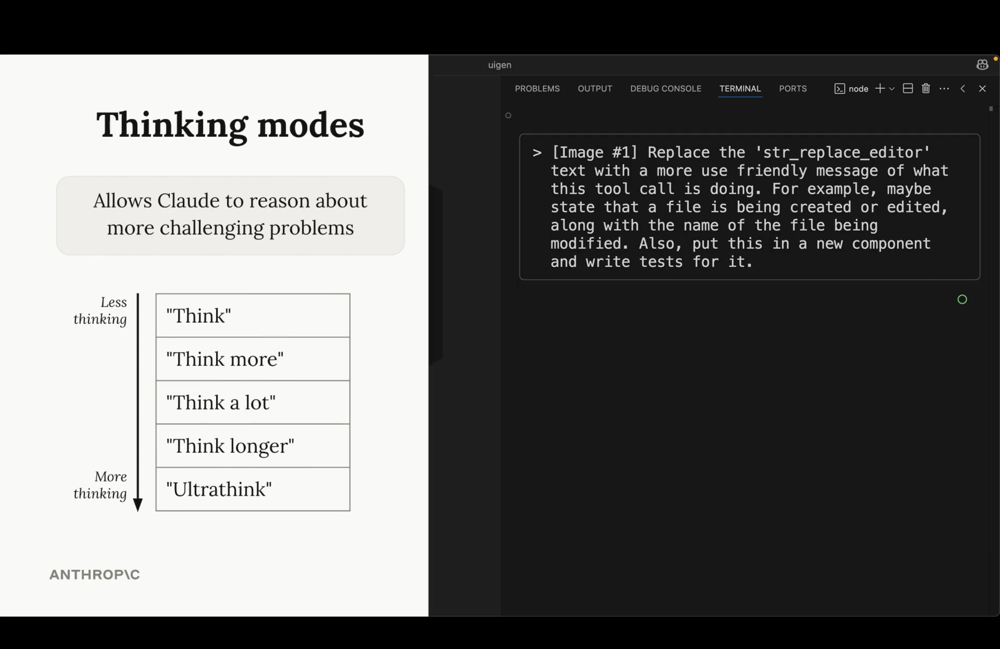

Claude offers progressive reasoning levels:
- **"Think"**: Basic reasoning
- **"Think more"**: Extended reasoning  
- **"Think a lot"**: Comprehensive analysis
- **"Think longer"**: Extended time reasoning
- **"Ultrathink"**: Maximum reasoning capability

#### When to Use Each Mode

**Planning Mode Best For:**
- Multi-file codebase changes
- Complex feature implementations
- Architecture modifications

**Thinking Mode Best For:**
- Algorithmic challenges
- Complex debugging
- Logic-intensive problems

### Context Control

Effective context management is crucial for productive sessions:

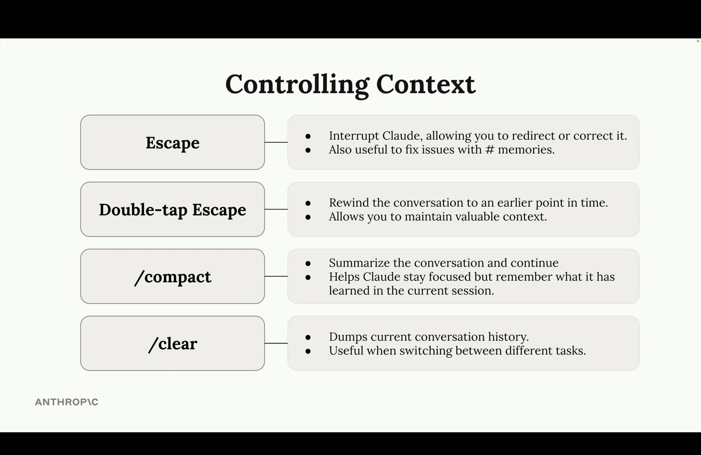

**Key Commands:**
- **Escape**: Interrupt and redirect Claude
- **Double-tap Escape**: Rewind to earlier conversation point
- **/compact**: Summarize and continue with preserved context
- **/clear**: Start fresh conversation

---

## 3. Advanced Capabilities

### Project Configuration with CLAUDE.md

Claude Code uses CLAUDE.md files for project-specific instructions and configuration:

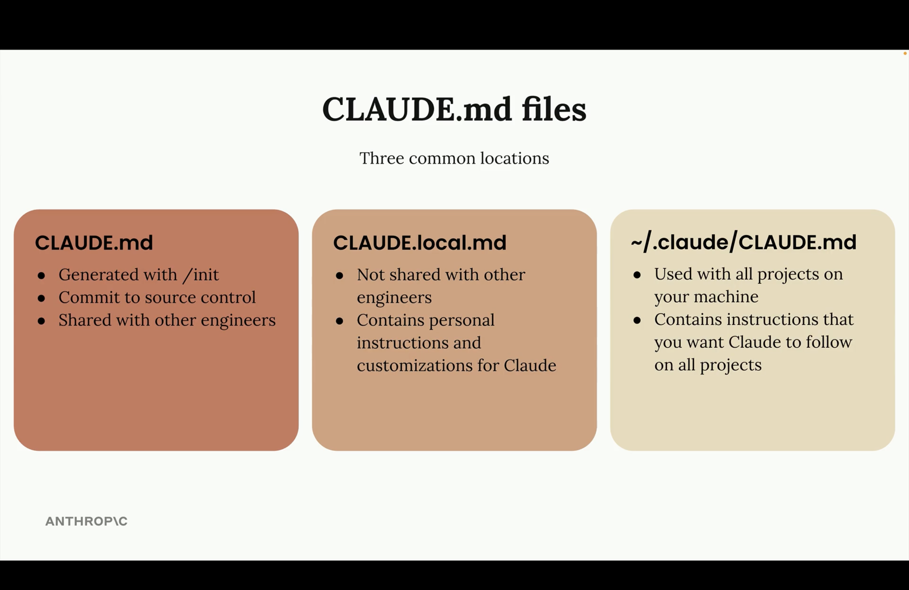

**Three Configuration Levels:**
1. **CLAUDE.md**: Project-level, committed to version control
2. **CLAUDE.local.md**: Personal, not shared with team
3. **~/.claude/CLAUDE.md**: Global, applies to all projects

### Hook System

Hooks enable automated workflows by executing commands in response to Claude Code events:

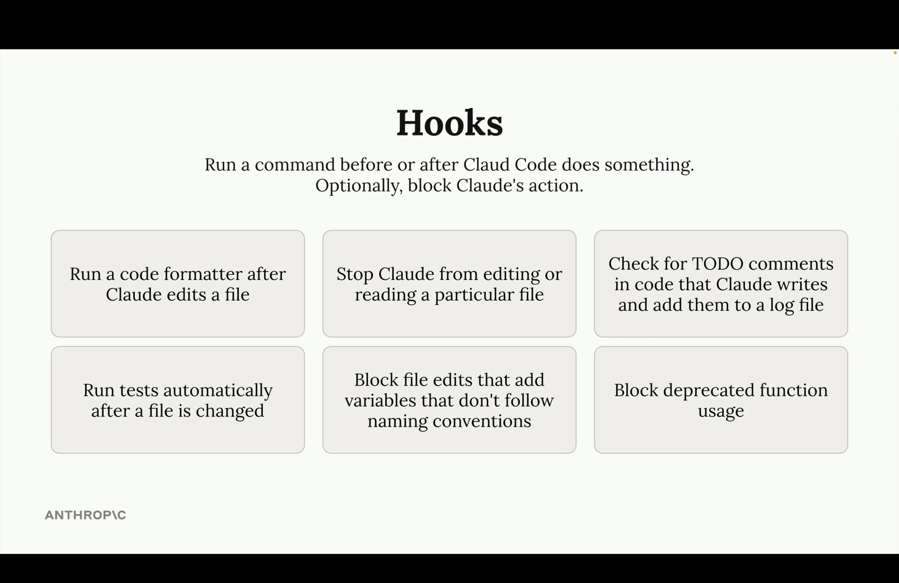

**Common Hook Use Cases:**
- Run code formatters after file edits
- Execute tests automatically after changes
- Check for TODO comments in code
- Block deprecated function usage
- Enforce naming conventions

#### Hook Execution Flow

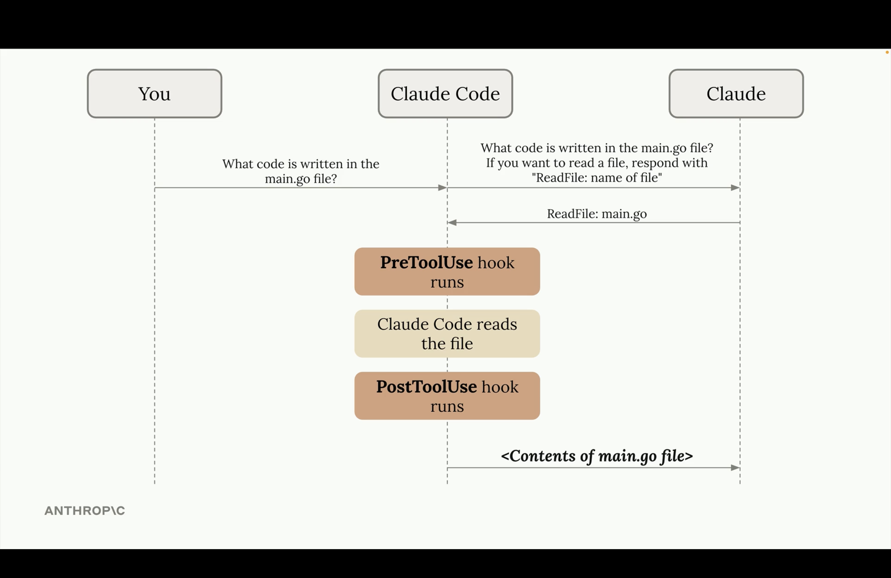

Hooks can run before (PreToolUse) and after (PostToolUse) tool execution, providing comprehensive workflow automation.

#### Hook Configuration

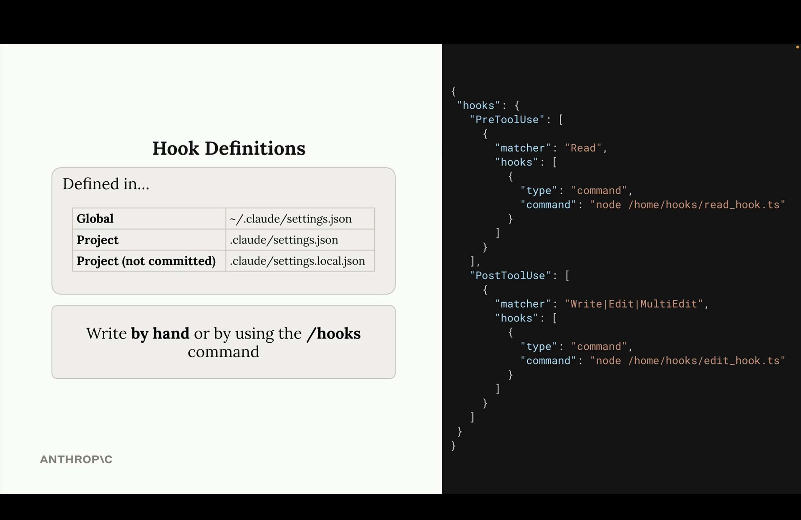

**Configuration Locations:**
- **Global**: `~/.claude/settings.json`
- **Project**: `.claude/settings.json` 
- **Project (not committed)**: `.claude/settings.local.json`

---

## 4. Configuration and Customization

### Claude Code SDK

For programmatic access and custom integrations:

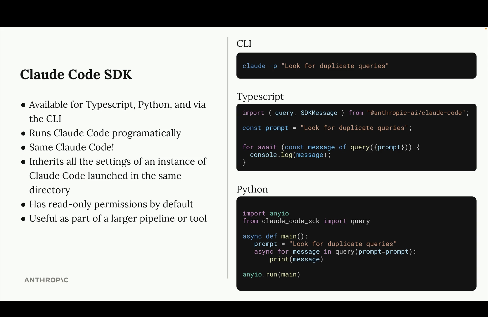

**SDK Features:**
- Available for TypeScript, Python, and CLI
- Programmatic Claude Code execution
- Same capabilities as interactive sessions
- Inherits all settings from instance directory
- Read-only permissions by default
- Perfect for larger pipelines and tooling

---

## 5. Integrations and Extensions

### MCP (Model Context Protocol) Servers

Extend Claude Code's capabilities with MCP servers:

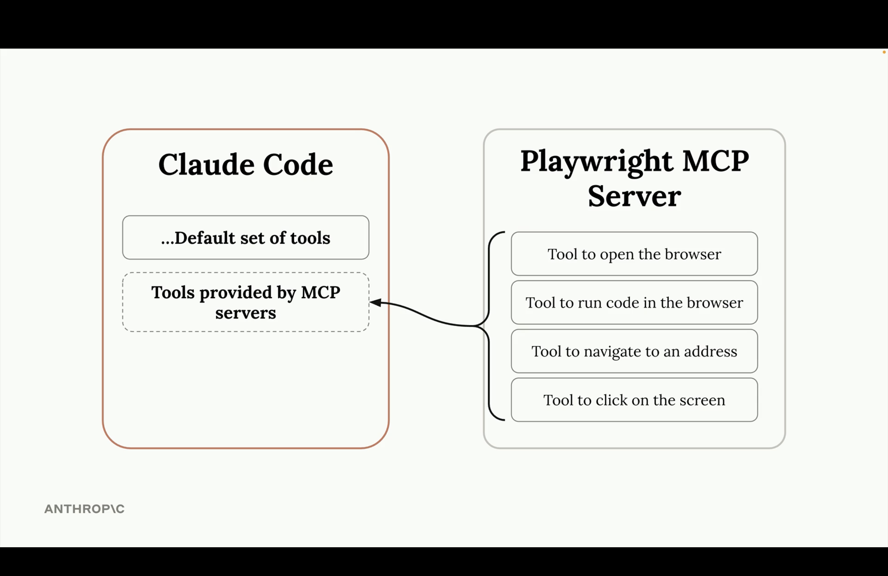

MCP servers provide additional tools like:
- Browser automation (Playwright)
- Database access
- API integrations
- Custom business logic

### GitHub Actions Integration

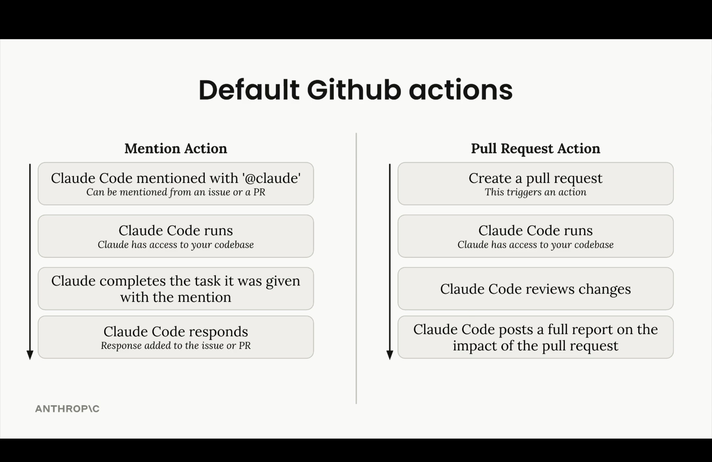

**Automated Workflows:**

**Mention Action:**
1. Claude Code mentioned with '@claude'
2. Claude runs with codebase access
3. Completes the requested task
4. Responds with results

**Pull Request Action:**
1. PR created triggers Claude Code
2. Claude reviews all changes
3. Provides comprehensive impact analysis
4. Posts detailed report

---

## 6. Real-World Project: UIGen

This course included building UIGen, a complete React application demonstrating Claude Code's capabilities in a real-world scenario.

### Technology Stack

**Frontend Framework:**
- Next.js 15 with App Router
- React 19 with TypeScript
- Tailwind CSS v4 for styling

**Backend & Database:**
- Prisma ORM with SQLite
- User authentication with bcrypt
- RESTful API design

**AI Integration:**
- Anthropic Claude via Vercel AI SDK
- Streaming responses for real-time interaction

**Development Tools:**
- Vitest with React Testing Library
- Monaco Editor for code editing
- ESLint for code quality

### Key Features Implemented

**Core Functionality:**
- AI-powered React component generator
- Live preview system with hot reloading
- Virtual file system for in-memory file management
- Real-time chat interface for AI interaction

**Advanced Features:**
- User authentication and session management
- Project persistence and sharing
- Syntax highlighting and error detection
- Responsive design with mobile support

### Architecture Highlights

**Virtual File System:**
- In-memory file management (`src/lib/file-system.ts`)
- Real-time file tree visualization
- Efficient state management across components

**Chat Interface:**
- Streaming AI responses
- Message history persistence
- Markdown rendering with syntax highlighting

**Preview System:**
- Live React component rendering
- Error boundary handling
- Hot module replacement simulation

---

## 7. Key Takeaways

### Essential Best Practices

#### 1. Master Planning and Execution
- Use **Planning Mode** for complex, multi-file changes requiring codebase understanding
- Apply **Thinking modes** for algorithmic challenges and complex problem-solving
- Remember both features consume additional tokens - use strategically

#### 2. Leverage File Operations Excellence
- Claude Code excels at understanding codebases through intelligent file discovery
- Always prefer editing existing files over creating new ones
- Follow existing code patterns and conventions automatically
- Use `Read`, `Glob`, and `Grep` tools effectively for navigation

#### 3. Embrace Advanced Workflow Features
- Implement **hooks** for automated code quality and testing workflows
- Use **todo management** for tracking complex multi-step implementations
- Take advantage of **parallel tool execution** for efficiency
- Configure **CLAUDE.md** files for consistent project behavior

#### 4. Optimize Context Management
- Use `/compact` to maintain valuable context while reducing token usage
- Apply escape commands strategically to redirect or rewind conversations
- Clear context with `/clear` when switching between different tasks

#### 5. Integrate with Your Development Ecosystem
- Explore **MCP servers** for extending capabilities
- Set up **GitHub Actions** for automated code review and assistance
- Use the **Claude Code SDK** for custom integrations and larger pipelines
- Configure hooks to match your team's development workflow

### Course Completion Achievement

By completing this course, you've gained:
- **Comprehensive understanding** of coding assistant architecture and capabilities
- **Practical experience** with Claude Code's full feature set
- **Real-world application** through the UIGen project implementation
- **Advanced workflow knowledge** including hooks, configuration, and integrations
- **Best practices** for efficient and effective AI-assisted development

Claude Code transforms the development experience by providing intelligent, context-aware assistance that scales with your project complexity. The key to mastery lies in understanding when and how to use each feature effectively.